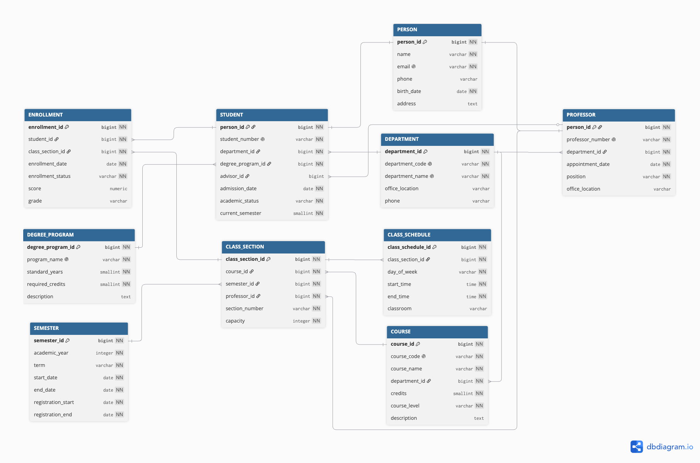

# PostgreSQL 학사관리시스템

대학의 학생, 교수, 학과, 학위과정, 교과목, 개설강의, 수강 및 성적 정보를 통합 관리하기 위해 설계한 PostgreSQL 데이터베이스 프로젝트입니다. 요구사항 분석부터 논리 모델링, ERD, 테이블 생성, 샘플 데이터 입력, 조회 쿼리 및 결과 보고서까지 포함합니다.

## 프로젝트 개요

- 학생과 교수의 공통 인적정보를 `person` 테이블에서 통합 관리
- `student`, `professor`가 `person.person_id`를 PK이자 FK로 공유하는 상위·하위 엔터티 구조 적용
- 교과목(`course`)과 학기별 개설 분반(`class_section`)을 분리
- 학생과 개설강의의 다대다 관계를 `enrollment`로 해소
- PK, FK, UNIQUE, NOT NULL, CHECK 제약조건과 조회용 인덱스 적용
- `COALESCE`, `CASE WHEN`, 날짜·집계 함수 및 다양한 JOIN 예제 제공

## ERD



데이터 모델은 총 10개 테이블로 구성됩니다.

| 테이블 | 설명 |
|---|---|
| `person` | 학생과 교수의 공통 인적정보 |
| `student` | 학번, 소속 학과, 학위과정, 지도교수 및 학적정보 |
| `professor` | 교수번호, 소속 학과, 직급 및 연구실 정보 |
| `department` | 학과 코드, 학과명 및 사무실 정보 |
| `degree_program` | 학사·석사·박사 과정과 이수 기준 |
| `course` | 교과목 코드, 과목명, 학점 및 주관 학과 |
| `semester` | 학년도, 학기 및 수강신청 기간 |
| `class_section` | 학기별 개설 과목의 분반, 담당 교수 및 정원 |
| `class_schedule` | 분반별 수업 요일, 시간 및 강의실 |
| `enrollment` | 학생의 수강신청 상태, 점수 및 등급 |

## 주요 관계

- `person` 1 : 0..1 `student`
- `person` 1 : 0..1 `professor`
- `department` 1 : N `student`, `professor`, `course`
- `degree_program` 1 : N `student`
- `professor` 1 : N `student` (지도교수)
- `course`, `semester`, `professor` 1 : N `class_section`
- `class_section` 1 : N `class_schedule`
- `student` N : M `class_section` (`enrollment`를 통해 연결)

## 실행 환경

- PostgreSQL
- DBeaver 또는 `psql`
- 선택 사항: DBML을 확인하거나 수정하려면 [dbdiagram.io](https://dbdiagram.io/) 사용

별도의 애플리케이션이나 외부 라이브러리는 필요하지 않습니다.

## 실행 방법

SQL 파일은 번호 순서대로 실행합니다.

### DBeaver

1. `postgres` 등 데이터베이스 생성 권한이 있는 데이터베이스에 연결합니다.
2. `sql/01_create_database.sql`을 실행합니다.
3. 새로 생성된 `academic_management` 데이터베이스로 연결을 변경합니다.
4. `sql/02_create_tables.sql`부터 `sql/07_verify_schema.sql`까지 순서대로 실행합니다.

### psql

```bash
psql -U postgres -d postgres -f sql/01_create_database.sql
psql -U postgres -d academic_management -f sql/02_create_tables.sql
psql -U postgres -d academic_management -f sql/03_insert_sample_data.sql
psql -U postgres -d academic_management -f sql/04_basic_queries.sql
psql -U postgres -d academic_management -f sql/05_function_queries.sql
psql -U postgres -d academic_management -f sql/06_join_queries.sql
psql -U postgres -d academic_management -f sql/07_verify_schema.sql
```

환경에 따라 사용자명, 호스트, 포트 옵션을 조정해야 합니다. `academic_management` 데이터베이스가 이미 존재하면 1번 스크립트는 오류가 발생하므로 생략하고 대상 데이터베이스에 연결하면 됩니다.

## SQL 파일 구성

| 순서 | 파일 | 내용 |
|---:|---|---|
| 1 | `sql/01_create_database.sql` | `academic_management` 데이터베이스 생성 |
| 2 | `sql/02_create_tables.sql` | 스키마, 10개 테이블, 제약조건 및 인덱스 생성 |
| 3 | `sql/03_insert_sample_data.sql` | 학과, 인물, 강의, 수강 및 성적 샘플 데이터 입력 |
| 4 | `sql/04_basic_queries.sql` | 전체·조건·정렬·복합·NULL·범위 조회 |
| 5 | `sql/05_function_queries.sql` | `COALESCE`, `CASE WHEN`, 날짜 및 집계 함수 예제 |
| 6 | `sql/06_join_queries.sql` | 학생·교수·강의·수강·학과 통계 JOIN 예제 |
| 7 | `sql/07_verify_schema.sql` | 테이블, 컬럼, 제약조건, 인덱스 및 데이터 건수 검증 |

각 SQL 스크립트는 `academic_management` 스키마를 검색 경로로 설정합니다. 테이블 생성과 샘플 데이터 입력은 트랜잭션으로 처리되어 실행 중 오류가 발생하면 변경 사항이 커밋되지 않습니다.

## 디렉터리 구조

```text
.
├── README.md
├── checklist.md
├── sql/                         # 생성, 입력, 조회 및 검증 SQL
├── docs/
│   ├── 1. requirements.md       # 시스템 요구사항
│   ├── 2. logical_model.md      # 논리 데이터 모델
│   └── 3. data_dictionary.md    # 엔터티·속성 데이터 사전
├── erd/
│   ├── ERD.png                  # ERD 이미지
│   └── academic_management_system.dbml
├── result/                      # SQL 실행 결과 캡처
├── report/                      # A4 HTML 보고서와 이미지·스타일
└── 광주_3반_신형섭_종합실습.pdf # 최종 제출 보고서
```

## 문서 및 결과 확인

- 상세 요구사항: [`docs/1. requirements.md`](docs/1.%20requirements.md)
- 논리 모델: [`docs/2. logical_model.md`](docs/2.%20logical_model.md)
- 데이터 사전: [`docs/3. data_dictionary.md`](docs/3.%20data_dictionary.md)
- DBML 원본: [`erd/academic_management_system.dbml`](erd/academic_management_system.dbml)
- HTML 보고서: [`report/index.html`](report/index.html)
- 최종 PDF 보고서: [`광주_3반_신형섭_종합실습.pdf`](광주_3반_신형섭_종합실습.pdf)

HTML 보고서는 `report/index.html`을 브라우저에서 열어 확인할 수 있습니다. PDF로 다시 출력할 때는 A4 용지, 배경 그래픽 사용, 브라우저 머리글·바닥글 해제를 권장합니다.

## 구현 범위

이 프로젝트는 학사 데이터 모델링 및 SQL 실습을 목적으로 합니다. 등록금, 장학금, 출결, 강의평가, 로그인·권한, 복수전공 및 재수강 상세 이력은 구현 범위에서 제외했습니다.
